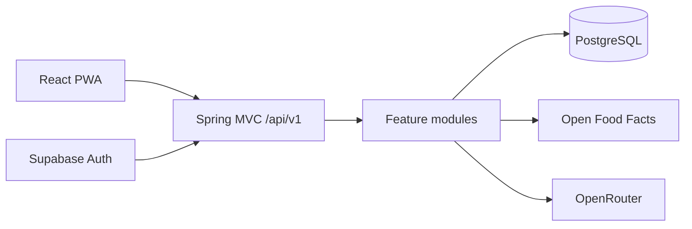
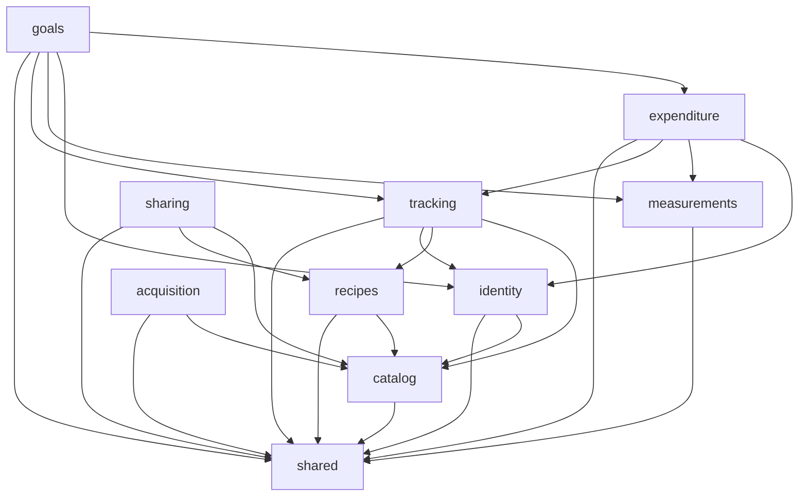
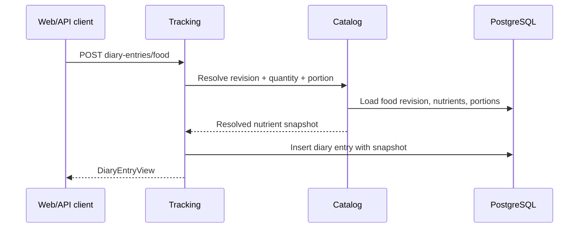
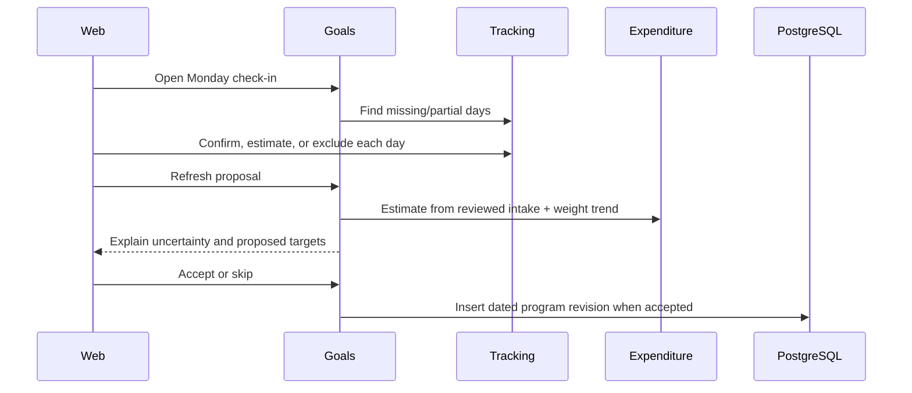

# Architecture

## Architectural style

Macrosaurus is a package-by-feature modular monolith. It has one Spring Boot
runtime and one PostgreSQL database, while Spring Modulith treats each direct
package below `com.macrosaurus` as an application module.

This gives the project transactional simplicity now without turning every
feature into an inseparable layer. A module can later be extracted only if scale,
team ownership, or deployment requirements justify it.



## Feature modules

| Module | Owns | May depend on |
|---|---|---|
| `identity` | Request user identity, profiles, nutrient targets, security configuration | `catalog`, `shared` |
| `catalog` | Nutrient definitions, foods, immutable food revisions, portions | `shared` |
| `recipes` | Recipe revisions, ingredient quantities, yields | `catalog`, `shared` |
| `tracking` | Diary entries, quick tracking, daily totals, coaching-day reviews | `catalog`, `recipes`, `identity`, `shared` |
| `measurements` | Weight measurements | `shared` |
| `expenditure` | Baseline and adaptive expenditure estimates | `identity`, `measurements`, `tracking`, `shared` |
| `goals` | Guided setup, weight goals, program revisions, weekly check-ins, resolved targets | `expenditure`, `identity`, `measurements`, `tracking`, `shared` |
| `acquisition` | EAN/UPC validation, OFF lookup, OpenRouter extraction | `catalog`, `shared` |
| `sharing` | Revocable immutable snapshots | `catalog`, `recipes`, `shared` |
| `shared` | Nutrient arithmetic, JSON support, current-user contract, API problems | Nothing feature-specific |

Dependency direction is intentionally one-way:



Every module exposes only cross-module contracts from its root package. Its
implementation is organized below that root:

```text
feature/
├── package-info.java   Modulith boundary and allowed dependencies
├── *Types.kt           Stable cross-module interfaces and snapshots, when needed
├── web/                Spring MVC controllers and transport DTOs
├── application/        Use-case orchestration and transaction boundaries
├── domain/             Framework-free calculations and invariants
├── persistence/        jOOQ queries and database record mapping
└── integration/        External provider adapters, when needed
```

Small modules omit layers they do not need. Related DTOs are grouped by transport
or capability; the project does not use a global `models` package or require one
class per file.

`ModularityTest` calls `ApplicationModules.verify()` and fails when code introduces
cycles or violates Spring Modulith's module rules.

## Module rules

1. A module owns its tables and business invariants.
2. A module may call another module only through a root-package contract.
3. A module must not issue SQL against another module's tables.
4. REST request/response classes belong to the module that exposes the endpoint.
5. Source-provider payloads are translated at the acquisition boundary.
6. Cross-module primitives stay small. `shared` must not become a miscellaneous
   domain dumping ground.
7. Historical calculations reference immutable revisions or store nutrient
   snapshots.
8. `DSLContext` and SQL stay in `persistence`; Spring MVC and Jakarta validation
   stay in `web`; `domain` code remains framework-free.

The current code uses jOOQ's `DSLContext` with explicit SQL. Flyway, not application
startup code, owns schema evolution.

## Main request flows

### Log a food



The diary entry is not recalculated when the food later changes.

### Build a recipe

The recipe module resolves every ingredient through the catalog, sums nutrient
snapshots, and stores an immutable recipe revision. If all ingredients have mass,
their sum becomes an estimated raw yield. An explicit finished weight takes
precedence for per-100-g calculations.

### Weekly coaching update



The model proposes; the user decides. Manual programs never receive automatic
target changes, and coached changes are capped per review to reduce overreaction.

### Scan a product

1. Normalize and checksum-validate the EAN/UPC.
2. Look for accessible local records.
3. Query Open Food Facts only when there is no local match.
4. If a label image is used, forward data URLs to OpenRouter without persisting
   the image bytes.
5. Store only the structured draft for review and record a 24-hour expiry
   timestamp.
6. Require a corrected/confirmed food request before inserting a private food.

The current extraction call is synchronous, and expiry is not yet enforced by a
cleanup task. `scan_jobs` preserves a job-shaped API so execution can move to a
worker without changing the client contract.

## Persistence and transactions

- PostgreSQL 17 is the target database.
- Flyway migrations live in `backend/src/main/resources/db/migration`.
- Numeric nutrition and measurement values use PostgreSQL `numeric` and Kotlin
  `BigDecimal`.
- Structured snapshots use `jsonb`.
- User-owned rows always include a user identifier checked in repository queries.
- Create/revise operations that affect multiple tables use Spring transactions.

See [Data model](data-model.md) for table ownership and invariants.

## Authentication and authorization

With `SUPABASE_URL` configured, Spring Security validates the Supabase JWT
signature through the project's JWKS, plus issuer, `authenticated` audience and
role, non-anonymous status, and UUID subject. `UserContext` uses that subject as
the Macrosaurus user identifier.

With no issuer configured, the backend permits requests and uses `X-User-Id` or
`dev-user`. This makes local development easy but is unsafe for a public network.

Public share retrieval at `/api/v1/shared/{token}` does not require authentication.
Share tokens are random, stored only as SHA-256 hashes, optional-expiry, and
revocable.

## Frontend

The React PWA is organized by route-level features over a reusable component and
design-system layer. React Router owns public/protected navigation, TanStack
Query owns server state, React Aria supplies accessible interaction primitives,
and `web/src/lib/api.ts` centralizes the hand-written API contract and Supabase/dev
headers. `App.tsx` is intentionally only a router entry point.

The generated service worker caches the application shell and brand assets. API
requests remain network-only; offline mutations and conflict resolution are not
implemented. See [Frontend architecture](frontend-architecture.md).

## Intentional future seams

- Acquisition providers sit behind services rather than domain types.
- The scan-job shape allows a separate worker and temporary object storage later.
- Food and recipe revisions can be exported without rewriting diary history.
- Spring Modulith's JDBC event registry and Jackson 3 serializer are installed as
  a future seam, but durable business events and webhook delivery are not yet
  implemented.
- The generated OpenAPI document can replace the current hand-written TypeScript
  client with generated SDKs.
