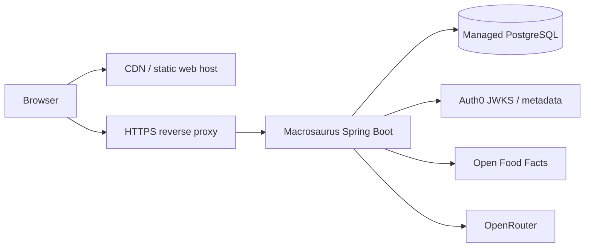

# Deployment and operations

## Build artifacts

```powershell
.\gradlew.bat :backend:bootJar --no-configuration-cache
pnpm --dir web build
```

Outputs:

- Executable backend jar: `backend/build/libs/backend-0.1.0-SNAPSHOT.jar`
- Static web application: `web/dist/`

The backend requires Java 26 because Kotlin and Java bytecode target 26.

## Recommended topology



The frontend and backend can share one public origin through routing (`/api` to
Spring and everything else to static assets), reducing CORS complexity.

## Runtime command

```powershell
java -jar backend-0.1.0-SNAPSHOT.jar
```

Inject configuration through the platform's secret/configuration facilities. Do
not ship a populated `.env` inside an image.

## Required production settings

- Strong `DATABASE_USERNAME` and `DATABASE_PASSWORD` with least privilege.
- TLS-enabled database connection as required by the provider.
- Nonblank `AUTH0_ISSUER_URI` and correct `AUTH0_AUDIENCE`.
- Real `OFF_USER_AGENT` contact details.
- `OPENROUTER_API_KEY` only if label extraction is enabled.
- A reviewed image-capable `OPENROUTER_MODEL`.
- Production CORS origin configuration; it is currently hard-coded for localhost
  and must be made configurable before launch.

## Database migrations

Flyway runs during application startup. Therefore:

- The application database user needs migration privileges today.
- Deploy only one migration-capable instance first when a migration is not safely
  concurrent.
- Back up before destructive or long-running migrations.
- Never deploy application code that expects a migration which failed.

A later setup may use a separate migration job/user and a lower-privilege runtime
user.

## Health and shutdown

- Liveness/readiness source: `/actuator/health` and its probe subpaths when the
  hosting platform uses them.
- Spring graceful shutdown is enabled, allowing in-flight requests to finish.
- Ensure the platform termination grace period is longer than Spring's shutdown
  timeout.

Do not expose all actuator endpoints directly to the internet. Place metrics
behind network policy/authentication and avoid adding user data to metric labels.

## Data protection

- Encrypt transport and storage.
- Treat profile, diary, and weight data as sensitive personal data.
- Back up PostgreSQL and test restoration.
- Define retention for scan drafts, audit data, backups, and deleted accounts.
- Keep external provider keys in a secret manager and rotate them.
- Avoid logging request bodies, tokens, label images, or nutrition/weight history.

Account export/deletion workflows and scheduled scan cleanup are not implemented;
they are launch blockers for the intended EU-first product.

## Production readiness checklist

- [ ] Configure and test Auth0 SPA callback/logout origins and the matching API audience.
- [ ] Make CORS configurable and restrict it to deployed origins.
- [ ] Add database-backed integration tests and run migrations on PostgreSQL 17.
- [ ] Implement full USDA importer and version metadata.
- [ ] Complete Open Food Facts licensing/attribution review.
- [ ] Add OpenRouter timeouts, retry/backoff, cost controls, and cleanup.
- [ ] Implement account export/deletion and retention jobs.
- [ ] Add rate limiting for public and provider-facing endpoints.
- [ ] Add structured logging, traces, dashboards, and alerts without sensitive data.
- [ ] Configure backups and perform a restore exercise.
- [ ] Perform dependency, authorization, and penetration testing.
- [ ] Add terms, privacy policy, wellness disclaimers, and incident procedures.
